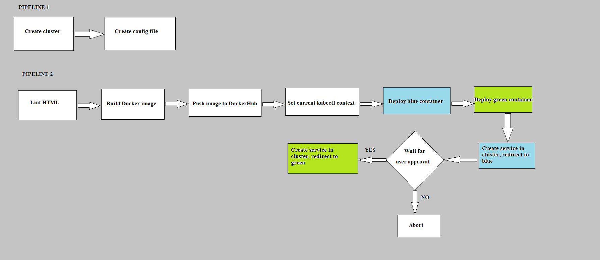

Udacity DevOps Capstone project
=================================

In this project, I have applied the lessons I have received from all the modules of Udacity Cloud DevOps Nanodegree program. 

##About the project

This project is about creating an image of an application, containerize it and deploy in a smooth and orchestrated manner using blue-green deployment pattern.

##Project works

In this project, I have been able to:
* Create clusters for a well orchestrated deployment
* Lint my application
* Create image of my application
* Upload the image to my image hub/registry
* Used the image to spin up containers
* Facilitate a blue-green deployment

##Project requirements
* AWS account
* Jenkins
* Blue Ocean plugin in Jenkins
* Pipeline-AWS plugin in Jenkins
* Docker
* Pip
* tidy linter
* AWS cli
* Eksctl
* Kubectl

##Files/folders included
* screenshots/ : Screenshots of the steps covered in the project
* Pipeline1_create cluster/ : Pipeline to build the infrastructure
* Pipeline2_deployment/ : Pipeline to lint, create image and deploy
* Jenkinsfile : To create stages of the pipelines
* Dockerfile : For building the image of the application
* green-controller.json : For creating a green-pod replication controller
* green-service.json : For creating the green service
* blue-controller.json : For creating a blue-pod replication controller
* blue-service.json : For creating the blue service
* index.html : index file of the website. 

##How to run the project
* Please follow to steps in the same order as in the 'screenshots' folder.
The deployed project can be seen in:
http://ab394b0154ebe4a519aae1d61d59d4d1-1149172759.us-west-2.elb.amazonaws.com:8000/